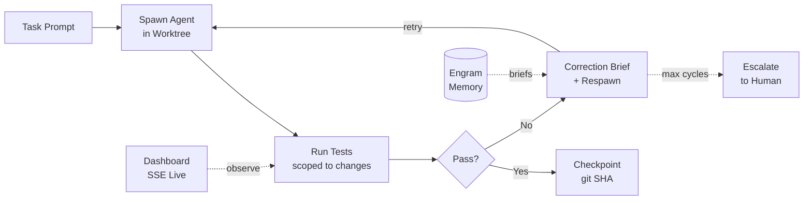
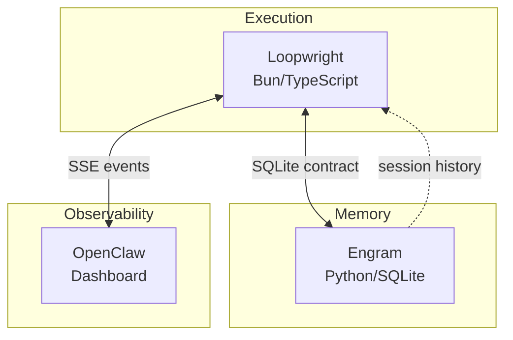

# Loopwright

**Self-correcting autonomous CI/CD with headless AI agents.**

Loopwright spawns AI agents in isolated git worktrees, runs tests against their changes, and automatically corrects failures — until the code passes or escalates to a human. No cloud infrastructure. No Docker. Just git, SQLite, and Bun.

---

## How It Works



### The Loop

1. **Task** — Agent receives a prompt (feature request, bug fix, refactor)
2. **Spawn** — Agent runs in an isolated git worktree. Main branch is never touched.
3. **Test** — Delta tests run first (only files that changed). Fast feedback, low noise.
4. **Checkpoint** — On pass: git SHA saved, worktree cleaned up. Changes live on the branch.
5. **Correct** — On fail: error context + correction brief injected, new agent spawned. It knows what broke.
6. **Escalate** — After N cycles or timeout: stop and hand off to a human. No infinite loops.

## Architecture

```
src/
├── loop.ts              # Main loop: spawn → test → checkpoint/correct → repeat
├── spawner.ts           # Agent spawning + registry + waitForAgent() + killAll()
├── test-runner.ts       # Delta file detection, scoped test execution, error parsing
├── correction-writer.ts # TestResult → correction_cycles rows in SQLite
├── corrector.ts         # Reads failures, calls Engram for correction brief
├── checkpoint.ts        # Git SHA snapshots
├── dashboard.ts         # Bun.serve() — SSE live feed, run form, abort, history
├── ab-runner.ts         # A/B test runner with worktree compare
├── db.ts                # SQLite ORM via bun:sqlite
├── bridge.ts            # JSONL event bridge
└── watchdog.ts          # Agent idle/finish detection
```

### Agent Support

Loopwright is agent-agnostic. It spawns any headless AI coding agent:

| Agent | Command | Status |
|-------|---------|--------|
| **Cursor Agent** | `cursor-agent -p --trust --workspace .` | Working |
| **Codex** | `codex exec --full-auto --sandbox danger-full-access` | Sandbox limitations with worktrees |
| **Claude Code** | `claude --dangerously-skip-permissions --print` | Confabulation on complex tasks |

### Stack

| Component | Role |
|-----------|------|
| **Bun** | Runtime, test runner, HTTP server, SQLite, process spawning |
| **Git Worktrees** | Isolated execution environments. Zero infrastructure. |
| **SQLite** | State: worktrees, correction cycles, checkpoints. Single file. |
| **[Engram](https://github.com/Prosperity-Labs/engram)** | Memory layer. Session history, correction briefs, project briefs. |

**Zero external dependencies.** No npm packages beyond Bun types. No Docker. No cloud.

## Circuit Breakers

Agents are powerful but unpredictable. Loopwright protects against runaway loops:

- **Agent timeout** (default 10 min) — kills the agent process if it hangs
- **Loop timeout** (default 30 min) — aborts the entire loop
- **No-change escalation** — if an agent makes zero file changes, escalate immediately
- **Auto-commit on cleanup** — saves uncommitted agent work to the branch before removing the worktree
- **SIGINT handler** — `killAll()` terminates every running agent on Ctrl+C

## Dashboard

Live control panel at `http://localhost:8790`:

- **Run form** — submit a task prompt, pick an agent, set max cycles
- **Live feed** — SSE stream of spawn, test, checkpoint, and correction events
- **Abort button** — kill a running loop mid-flight
- **Run history** — past runs with status, branch, duration
- **Cycle visualization** — see each correction cycle's errors and changes

```bash
bun run src/dashboard.ts
```

## Quick Start

```bash
# Clone
git clone https://github.com/Prosperity-Labs/Loopwright.git
cd Loopwright

# Install
bun install

# Run tests (55 tests)
bun test

# Start dashboard
bun run src/dashboard.ts

# Run a loop from CLI
bun run src/loop.ts "Add a hello() function to lib.ts with a test" /path/to/repo
```

### Environment Variables

| Variable | Default | Description |
|----------|---------|-------------|
| `LOOPWRIGHT_AGENT_TYPE` | `claude` | Agent to use: `claude`, `codex`, `cursor` |
| `LOOPWRIGHT_AGENT_TIMEOUT_MS` | `600000` | Max time for a single agent run |
| `LOOPWRIGHT_LOOP_TIMEOUT_MS` | `1800000` | Max time for the entire loop |

## Example: Real Task

We ran Loopwright against its own memory layer (Engram) to add a `session_count()` method:

```
Task:    "Add session_count(self, project=None) to SessionDB. Add tests. Run pytest."
Agent:   Cursor Agent
Result:  PASSED after 1 correction cycle

Cycle 0: Agent wrote method + 4 tests → existing test failed (unrelated)
Cycle 1: Correction agent fixed the bug → all 277 tests passed
          Auto-committed to branch → worktree cleaned up → changes preserved
```

The recursive part: Engram's cursor hook recorded every edit the agent made *on Engram itself*. The system observed itself.

## Project Structure

Loopwright is part of a three-layer stack:



| Layer | Project | Language | Role |
|-------|---------|----------|------|
| **Execution** | Loopwright | Bun/TypeScript | Orchestrates the correction loop |
| **Memory** | [Engram](https://github.com/Prosperity-Labs/engram) | Python | Session history, failure patterns, briefs |
| **Observability** | OpenClaw | TypeScript | Live cross-agent tracking, dashboard |

One SQLite file. Three interfaces. The data compounds over time.

## Tests

```bash
bun test           # 55 tests across 13 files
```

Tests cover: loop lifecycle, circuit breakers, agent timeouts, worktree cleanup, auto-commit preservation, test runner scoping, error parsing, correction cycles, checkpoints, A/B comparison, and the event bridge.

## Status

**Sprint 1 complete.** The self-correcting loop works end-to-end:

- [x] SQLite schema + event bridge
- [x] Agent spawner with registry
- [x] Delta test runner (Bun + pytest)
- [x] Correction cycle writer
- [x] Full autonomous loop
- [x] Circuit breakers (agent/loop timeouts, no-change escalation)
- [x] Auto-commit before worktree cleanup
- [x] Dashboard with live control
- [x] Real task execution (Engram `session_count()` via Cursor Agent)
- [ ] Staging integration
- [ ] A/B validation with real users
- [ ] Progressive rollout

## License

MIT

---

*Built by [Prosperity Labs](https://github.com/Prosperity-Labs)*
