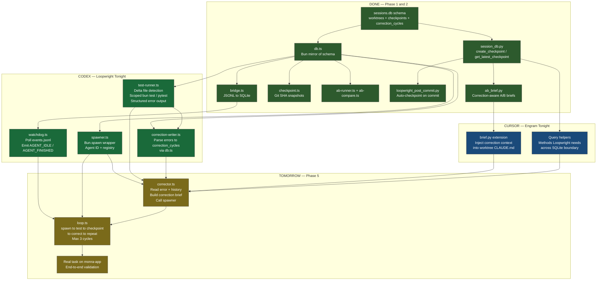

# Loopwright Sprint 1 — Dependency Graph

```mermaid
graph TD
    subgraph "DONE — Phase 1 and 2"
        S1[sessions.db schema<br/>worktrees + checkpoints + correction_cycles]
        S2[db.ts<br/>Bun mirror of schema]
        S3[bridge.ts<br/>JSONL to SQLite]
        S4[checkpoint.ts<br/>Git SHA snapshots]
        S5[ab-runner.ts + ab-compare.ts]
        S6[session_db.py<br/>create_checkpoint / get_latest_checkpoint]
        S7[loopwright_post_commit.py<br/>Auto-checkpoint on commit]
        S8[ab_brief.py<br/>Correction-aware A/B briefs]
    end

    subgraph "CURSOR — Engram Tonight"
        C1[brief.py extension<br/>Inject correction context<br/>into worktree CLAUDE.md]
        C2[Query helpers<br/>Methods Loopwright needs<br/>across SQLite boundary]
    end

    subgraph "CODEX — Loopwright Tonight"
        L1[watchdog.ts<br/>Poll events.jsonl<br/>Emit AGENT_IDLE / AGENT_FINISHED]
        L2[spawner.ts<br/>Bun.spawn wrapper<br/>Agent ID + registry]
        L3[test-runner.ts<br/>Delta file detection<br/>Scoped bun test / pytest<br/>Structured error output]
        L4[correction-writer.ts<br/>Parse errors to correction_cycles<br/>via db.ts]
    end

    subgraph "TOMORROW — Phase 5"
        F1[corrector.ts<br/>Read error + history<br/>Build correction brief<br/>Call spawner]
        F2[loop.ts<br/>spawn to test to checkpoint<br/>to correct to repeat<br/>Max 3 cycles]
        F3[Real task on monra-app<br/>End-to-end validation]
    end

    %% Existing foundations
    S1 --> S2
    S1 --> S6
    S2 --> S3
    S2 --> S4
    S2 --> S5
    S6 --> S7
    S6 --> S8

    %% Cursor dependencies
    S8 --> C1
    S6 --> C2

    %% Codex dependencies — all independent of each other
    S3 --> L1
    S2 --> L2
    S2 --> L3
    S2 --> L4
    L3 --> L4

    %% Tomorrow depends on tonight
    L1 --> F2
    L2 --> F1
    L2 --> F2
    L3 --> F1
    L4 --> F1
    C1 --> F1
    C2 --> F1
    F1 --> F2
    F2 --> F3

    %% Styling
    style S1 fill:#2d5a2d,stroke:#4a4a4a,color:#fff
    style S2 fill:#2d5a2d,stroke:#4a4a4a,color:#fff
    style S3 fill:#2d5a2d,stroke:#4a4a4a,color:#fff
    style S4 fill:#2d5a2d,stroke:#4a4a4a,color:#fff
    style S5 fill:#2d5a2d,stroke:#4a4a4a,color:#fff
    style S6 fill:#2d5a2d,stroke:#4a4a4a,color:#fff
    style S7 fill:#2d5a2d,stroke:#4a4a4a,color:#fff
    style S8 fill:#2d5a2d,stroke:#4a4a4a,color:#fff
    style C1 fill:#1a4a7a,stroke:#4a4a4a,color:#fff
    style C2 fill:#1a4a7a,stroke:#4a4a4a,color:#fff
    style L1 fill:#1a6a3a,stroke:#4a4a4a,color:#fff
    style L2 fill:#1a6a3a,stroke:#4a4a4a,color:#fff
    style L3 fill:#1a6a3a,stroke:#4a4a4a,color:#fff
    style L4 fill:#1a6a3a,stroke:#4a4a4a,color:#fff
    style F1 fill:#7a6a1a,stroke:#4a4a4a,color:#fff
    style F2 fill:#7a6a1a,stroke:#4a4a4a,color:#fff
    style F3 fill:#7a6a1a,stroke:#4a4a4a,color:#fff
```
